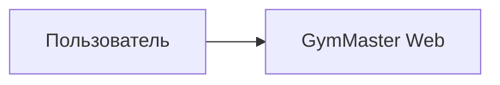

# Персона и сценарии

## Персона

### Администратор платформы

- **Цель:** заводить и сопровождать **учётки** с ролью **trainer** (доступ в кабинет тренера).
- **Контекст:** **отдельный раздел** приложения и **отдельный интерфейс** (не смешивать с повседневным UI «ведения клиентов» в зале); **тот же** логин, если роли совмещены.
- На старте один человек (например вайбкодер) обычно **тренер** с **`platform_admin`**, выданным **вне** UI (bootstrap); **один** логин на кабинет и админ-раздел.

### Тренер (пользователь с аккаунтом)

- **Цель:** вести несколько клиентов, не терять контекст плана и факта, видеть прогресс по сплиту и по упражнениям.
- **Контекст:** работа в зале, возможны **несколько клиентов параллельно** и **несколько текущих тренировок** сразу; нужны быстрый ввод и **переключение** между активными сессиями и карточками клиентов.
- **Тех. уровень:** вайбкодер — допустимы продвинутые настройки (экспорт, деплой) без упрощения UX до «для бабушки».

### Клиент (в системе как данные)

Учётная запись и вход **не** требуются. Отображается имя (и при необходимости заметки тренера). Всё ценное — планы, факты, сплит, история упражнений **в разрезе клиента**.

---

## Сценарии MVP

| ID | Сценарий | Примечание |
|----|----------|------------|
| UC-ADM | **Админ:** открыть **раздел администрирования**; **создать** учётку с ролью **trainer** (логин/email, пароль или временный); **заблокировать**/**разблокировать**; **сбросить пароль** | Первый админ — см. **ADMIN-BOOT-001** |
| UC-00 | **Тренер:** **вход**, **выход**; сессия только со **своими** данными | Смена пароля — см. FR; саморегистрации нет |
| UC-01 | Завести клиента и при необходимости задать **пул тегов** типа дня (свободные метки; можно дополнять при каждой тренировке) | См. `05-tech-and-data.md` |
| UC-02 | Создать **один или несколько** **планов** на будущее (следующая тренировка, ещё одна за ней, …): у каждого **тег** типа дня, упражнения, подходы, целевые веса/повторы (+ опционально: отдых, RPE, заметки) | Плановая **дата** на каждом плане для «что дальше» |
| UC-03 | **Старт** тренировки с **плана** (или с нуля): сессия **в процессе**; исполнение / пропуск / **внеплановые** упражнения; **завершение** → факт в истории | Параллельно — **UC-03b** |
| UC-03b | Две (или более) **текущих** тренировки у **разных** клиентов; **переключение** между ними; **завершение** в любой очереди | См. **UX-002**, **FACT-003** |
| UC-04 | Просмотр **план vs факт** на одном экране (или явное сопоставление блоками) | «Наглядно» — приоритет UX |
| UC-05 | Сравнение с **прошлой аналогичной** тренировкой (тот же **тег**, тот же клиент) | Трен дня в день или к ключевым упражнениям |
| UC-06 | **История упражнения** для клиента: таблица/график весов и подходов по датам | Фильтр по упражнению |
| UC-07 | **Переключение клиента** и **текущих тренировок** за 1–2 действия | **UX-001**, **UX-002**: недавние, активные сессии |

---

## Диаграмма контекста

Один и тот же пользователь при совмещении ролей переходит в **кабинет тренера** или в **раздел администрирования** внутри одного приложения.

Внешние интеграции в MVP **не** обязательны.

---

## Отложенные сценарии (после MVP)

- Публичная **саморегистрация** тренера (если откажутся от модели «только админ выдаёт доступ»).
- Копирование плана с клиента на клиента или из шаблона «типичная нога».
- Напоминания о тренировках (если появится календарь / уведомления).
- Экспорт отчёта клиенту PDF / ссылка (если понадобится).
